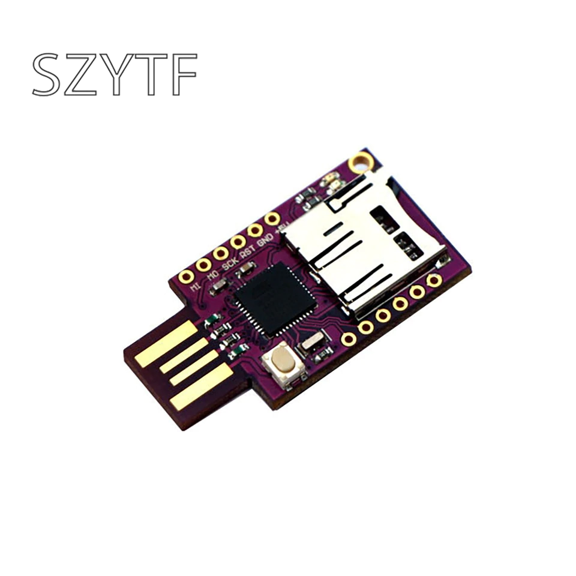
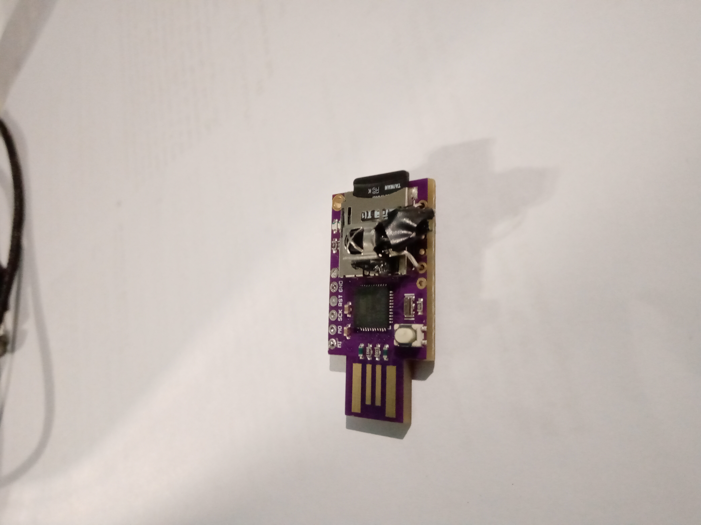
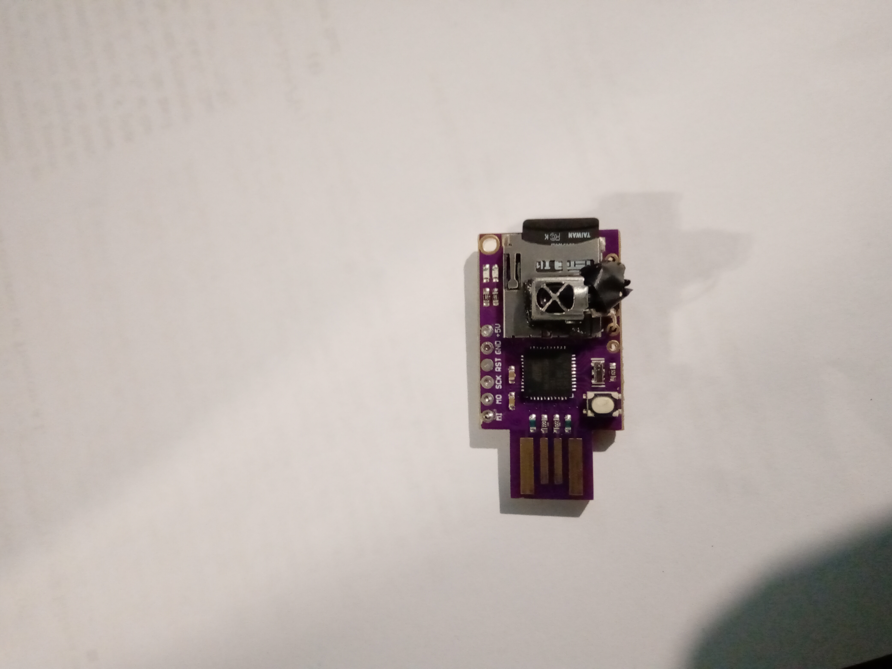
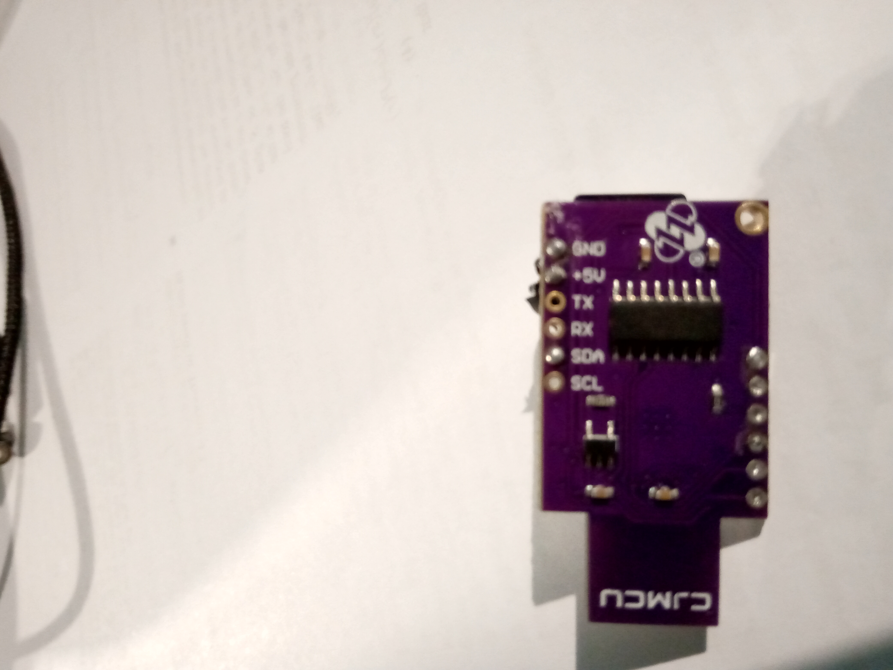

# IR BAD-USB 

### Warning

The code available on this repo comes from the aggregation of multiple publicly available origins frankensteined together to provide the functionality that I was looking for

The code available here is not fully tested, error might occur

Made to work with: CMJCU badusb with micro-sd card

## Includes

* **pt-pt** keyboard layout support if used as is, to support others you must change the provided **arduino_keyboardlib** library (in *arduino_keyboardlib-master* folder)

+ Support to ducky scripts
+ Integration with Infra-Red (IR) remote controller

## Requirements

* Soldering equipment
* IR receiver + IR remote compatible with IRremote arduino library
* micro-sd card of any size compatible with the sd slot of the usb
* Arduino IDE

## Instructions

* Install the provided arduino keyboard lib (**arduino_keyboardlib-master**) into the arduino library path (Just copy the folder and past it on the library folder)

* Solder the signal pin of the IR receiver to the **SDA** hole on the usb board 

* Solder IR receiver ground and vcc pins to the board **GND** and **+5V** holes on the usb board

  **BE CAREFUL TO ISOLATE ALL THE IR RECEIVER PINS FROM ONE ANOTHER, OTHERWISE SHORT CIRCUITS MIGHT OCCUR**

* Change the received IR codes and their respective behaviour to match your intention and the IR remote used. This can be done by altering the *executeAction(int code)* function on the bottom of the **BadUSB.ino** file

* Flash the **BadUSB.ino** into the board using arduino IDE

## Result Images

Sorry for the lack of image quality :)

**TAGS**: infrared, IR, badusb, ducky, pt-pt, pt, cmjcu, sd